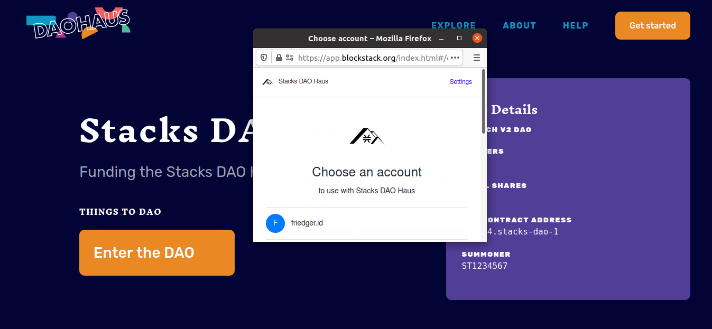

# DAO in Clarity


## Moloch DAO

A conversion of [Moloch DAO 2.1 in Solidity](https://github.com/HausDAO/Molochv2.1/blob/6840897f8766d4c5cc6cfd7a4b8a8f98cb9644b5/Flat_Moloch_v2.1.sol) into Clarity

Moloch DAO is a grant-making internet community contract that can hold multiple tokens, make investments, give grants, trade tokens. Members of the dao can vote for proposal. A proposal passes with a simple majority. However, members who did not vote yes can quit the community and take their fair shares. This incentivises proposals that all member can live with. The more members ragequit with their fair share the more the shares of the remaining members is diluted.

It has a small set of features to make it understandable and less error prone. It has been described in various places and forms:

- [First github repository](https://github.com/austintgriffith/moloch)
- [Audio](https://epicenter.tv/episodes/297/)
- [FAQ](https://daohaus.club/help#xDAI)
- [Primer for humans](https://medium.com/raid-guild/moloch-evolved-v2-primer-25c9cdeab455)

The Solidity version has been deployed to the Ethereum chain and xDai chain and is accessible via https://daohaus.club

The contract has **NOT** been tested thoroughly. Use with care!

### Implementation in Clarity

The Clarity code is very close to the origin Solidity code, the same variables and functions names have been used. Users familiar with the Solidity contract should be able to recognize most of the code in Clarity.

The main functions are

1. `submit-proposal*` and `cancel-proposal`
1. `sponsor-proposal`
1. `submit-vote`
1. `process-proposal*`
1. `ragequit` and `ragequit`

Other functions are available to manage tokens.

The contract supports any token that implements a basic fungible token trait. The trait is defined in a separate contract so that it can be replaced with a standard trait when available.

### Testing

The contract can be deployed to the mocknet or testnet.

#### Unit Tests

Basic unit tests are available to check the syntax of the contracts. The contracts can't be tested beyond syntax checking in the Clarity VM because the DAO contract depends on block times which are not available in the VM (`Failed to get block data.`). For unit tests run:

```
yarn mocha test/dao
```

#### Setup for Tests on Mocknet

Start your mocknet with the provided `Stacks.toml`.

```
stacks-node testnet start --config=./Stacks.toml
```

Deploy the contracts using

```
yarn mocha test/deploy
```

##### Proposal flow

In `test/integration.ts` the relevant functions are defined to go through a basic proposal flow.
After the contracts are deployed (due to the length of the dao contract it takes longer than usual). Run

```
yarn mocha test/proposal-life-cycle.ts
```

### Application as Web App

Currently, there is not working UI. Some work to adapt https://daohaus.club to support Moloch DAOs on the Stacks chain has been started at [friedger/daohaus-web](https://github.com/friedger/daohaus-web) and [friedger/pokemol-web](https://github.com/friedger/pokemol-web). It also requires modications of stacks-node-api to better match the moloch server API. This is still work to be done.



### Application as CLI

The application can be used with mocha tests:

1. get tokens from faucet: `yarn mocha -g "faucet"`
1. submit proposal: `yarn mocha -g "submit proposal"`
1. sponsor proposal: `yarn mocha -g "sponsor proposal"`
1. submit votes: `yarn mocha -g "submit votes"`
1. process proposal: `yarn mocha -g "process proposal"`

[Explainer video](https://youtu.be/TFWVJDcsD24)

### Remarks

- The contract maintains an internal balance of tokens for all members in addition to the balance of total tokens, an escrow and the dao bank. These are prepresented by contract principals as contracts can never be a transaction sender. In solidity special, well-known addresses were used.
- The function `ragequit` can't be tested due an [error in stacks.js](https://github.com/blockstack/stacks.js/issues/872).
- Currently, the contract uses many checks that result in aborting the transaction (`panic`). This does not provide any useful information to the user of the contract. This can be improved by changing to early returns (`asserts!`) with the required additional error handling.
- Withdrawing a set of tokens in one transaction was not implemented due to handling traits in tuples (needs more investigation if possible with VM limitations on traits).
- The contract contains some reusable functions for handling a list of flags (that here represent that possible states of a proposal).
- The current tooling makes development and testing difficult.
  - Currently, the Clarity RPL does not support `contract-of` and `string-utf8`. Therefore, typos, syntax errors and type errors could not be detected in Visual Studio code, but only after deploying on mocknet.
  - Currently, the Clartiy SDK does not support `block data`. Therefore, no unit tests were written.
- The contract is structured through comments in between different sections:
  - Data storage
  - Public functions
  - Functions that do not change the state with subsections for different areas
  - Functions that change the state also with subsections for different areas  
    Currently, there is no other support for long contracts. It might be possible to split the contract into several contracts (needs more investigation).
- There are few long functions that update one or more values of a map. [Type aliases](https://github.com/clarity-lang/reference/issues/6) and [merge function](https://github.com/blockstack/stacks-blockchain/pull/2117) would have been helpful here.

General warning: The contract has **NOT** been tested thoroughly. Use with care!
